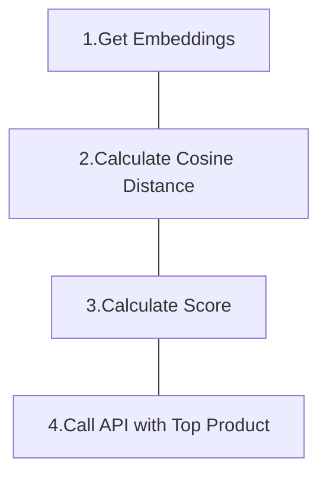

This project is an backend for Patent Infringement Check Requirements.

---

### How to launch

#### Launch by docker-compose

- clone this repository
  - `git clone https://github.com/dychendavid/patent_check_api`
- put .env in the folder(below sample)
- startup python + postgres
  - `docker compose up -d`
- alternative with `--build` for code/.env updates
  - `docker compose up -d --build`
- test db connection and api in browser
  - `http://{localhost}:8000/db_test`
- seeding data by api call
  - `http://{localhost}:8000/db_seeder`
  - or this command
  - `docker compose exec python python seeder.py`

#### Launch native python + docker-compose

- clone this repository
  - `git clone https://github.com/dychendavid/patent_check_api`
- put .env in the folder(below sample)
- remove the _python_ service in docker-compose.yml
- startup postgres
  - `docker compose up -d`
- execute your python
  - ex: `fastapi dev`
- test db connection and api in browser
  - `http://{localhost}:8000/db_test`
- seeding data by api call
  - `http://{localhost}:8000/db_seeds`
  - or this command
  - ex: `python seeder.py`

```
# .env sample

# DB_HOST needs same with service name in docker compose
DB_HOST=postgresql
DB_NAME=patent_check
DB_USER=postgres
DB_PASS=postgres

# This value reference to number of related claims
QUALIFY_DISTANCE_RANGE=0.45

# I'll glad to provide the OPENAI_API_KEY, please let me know
OPENAI_API_KEY=xxxxx

```

---

### Improving Plan

- Enable RabbitMQ for break heavy task.
- Enable Socket.Io for non-blocking API communication

---

### How to determine which products is the top possibily infringement products?

#### Simple Flow



### Step 1. Get Embeddings

- Pick up columns which most info
  - This case is Project Description, Claim Description
- Retrieve and save the embedding of picked columns by calling Open AI Embedding API

> We should keep all the embedding comes from same source and same version.

> Keep consistency is important than follow latest version.

<br />

### Step 2. Calculate Cosine Distance

- Calculate the cosine distance between vector of Product Description and Claim Description, for finding the association.
  - by using pgvector
- The table rows growth: <br />
  - 1 Company have `N` Products.<br />
  - 1 Product have distances with `M` Claims.
  - So the rows between specific company and specific patent, it will increase `N * M` rows
- The table columns

```python
company_id,      # int
product_id,      # int
product_desc,    # varchar

patent_id,       # int
claim_id,        # int
claim_desc,      # varchar

cosine_distance  # float
```

<br />

### Step 3. Calculate Infringing Possibility Score

- Find a formula to determine Possibility Score
- Smaller distance should be considered strong association, larger distance probably considered low association.

  - Filter out the distances which over threshold, since the association maybe too low and no important value for reference.<br />
  - Add up remaining distances to get a Possibility Score, maybe the future version we can higher the weight of Claims number.
    > Ex: Claim number \* 2 + Sum of distances = Possibility Score

- The table columns

```python
company_id,     # int
product_id,     # int

patent_id,      # int
product_name,   # varchar
product_desc,   # varchar
claim_ids,      # int array
claim_descs,    # varchar array

score           # float
```

<br />

### Step 4. Using LLM to do analyze

Send related info to LLM without our previously calculated distances for get more diversify analysis result, and using Langchain to make sure LLM output format.

<br />
